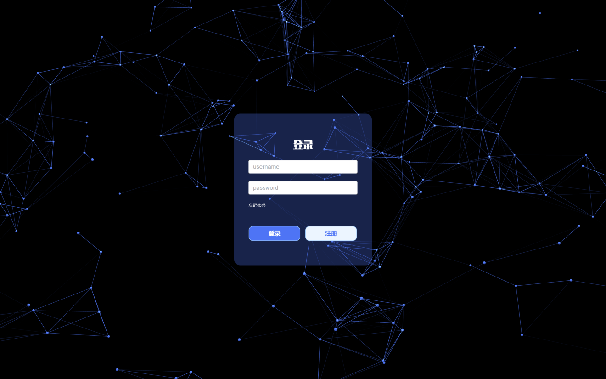
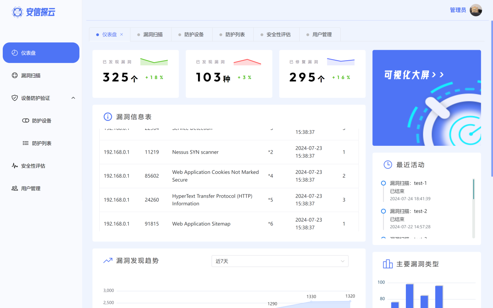
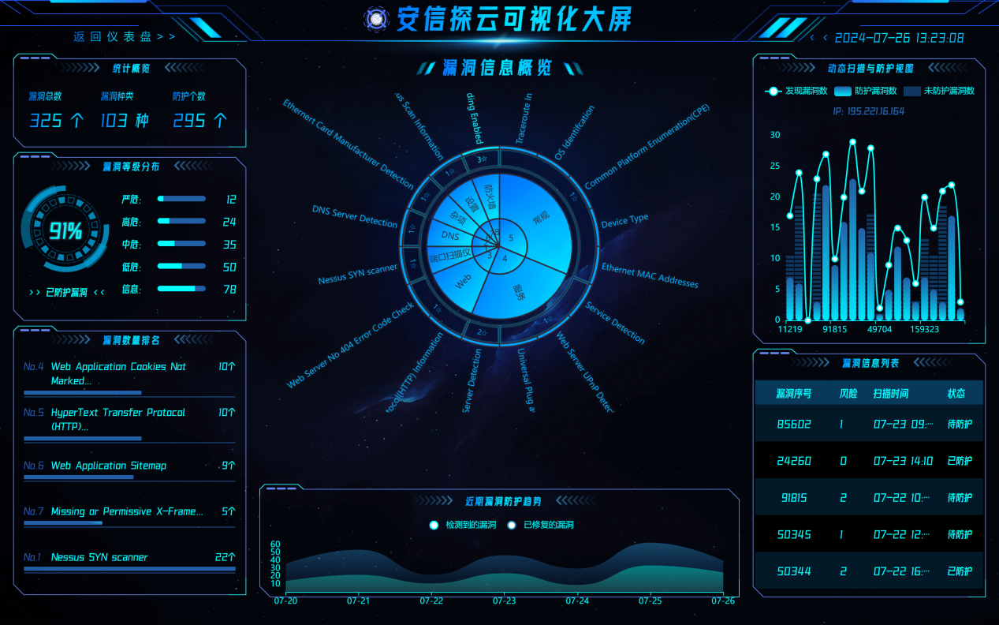
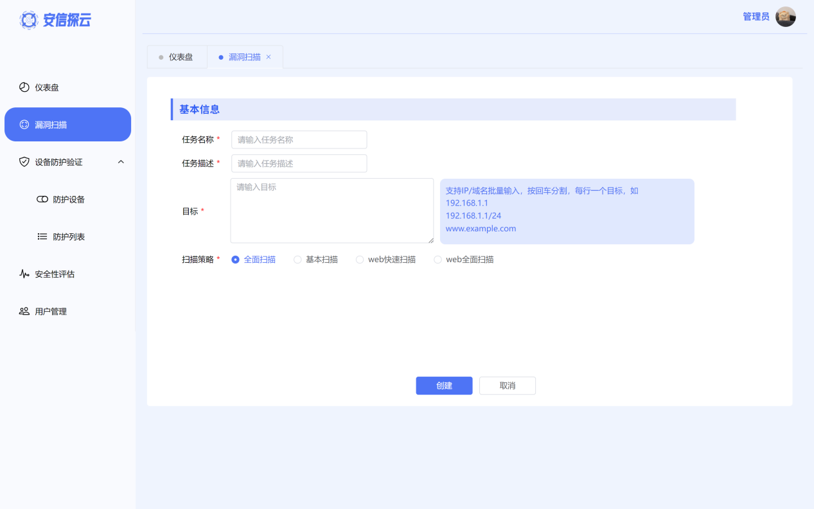

# 安信探云 - 前端项目

基于信创环境的网络安全测试验证靶场平台前端实现，为网络安全测试提供可视化操作界面与数据展示功能。

## 项目简介

"安信探云"是第十九届"挑战杯"竞赛"揭榜挂帅"专项赛参赛项目，旨在构建一体化全链路的信创环境安全测试验证平台。本前端项目基于Vue.js框架开发，实现了漏洞扫描、设备防护验证、安全性评估等核心功能的用户交互界面，支持信创环境下的网络安全测试全流程可视化管理。

## 核心功能

- **用户交互模块**：登录注册、权限管理
- **数据可视化模块**：仪表盘、安全态势大屏展示
- **漏洞扫描模块**：任务创建、扫描结果展示与详情查看
- **设备防护验证模块**：防护设备配置、防护效果对比
- **安全性评估模块**：评估报告生成与展示

## 技术栈

- **前端框架**：Vue.js
- **UI组件**：Element Plus
- **可视化库**：ECharts、DataV
- **三维效果**：Vanta.js
- **构建工具**：Vite
- **HTTP客户端**：Axios

## 界面展示

### 登录界面

*使用Vanta.js实现三维背景效果，提升科技感*

### 仪表盘

*整合关键安全指标，直观展示系统安全状态*

### 可视化大屏

*全链路安全态势监控，支持多维度数据展示*

### 漏洞扫描

*支持多目标批量扫描与漏洞详情查看*

### 设备防护验证

*防护设备配置与防护效果对比分析*

## 快速开始

### 环境要求
- Node.js 14+
- npm 6+

### 安装步骤

```bash
# 克隆仓库
git clone https://github.com/superxiu/VulGuard.git

# 进入项目目录
cd VulGuard

# 安装依赖
npm install

# 本地开发环境启动
npm run dev

# 构建生产版本
npm run build
```

## 参与贡献

1. Fork 本仓库
2. 创建特性分支 (`git checkout -b feature/amazing-feature`)
3. 提交更改 (`git commit -m 'Add some amazing feature'`)
4. 推送到分支 (`git push origin feature/amazing-feature`)
5. 打开Pull Request


## 联系方式

- 项目团队：银河护卫队
- 邮箱：yoongi2025@163.com

---

*本项目为第十九届"挑战杯"竞赛参赛作品，旨在推动信创环境下网络安全测试技术的发展与应用*
